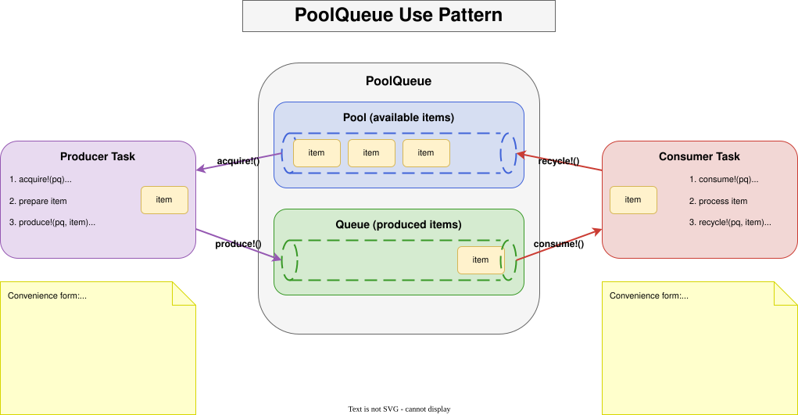
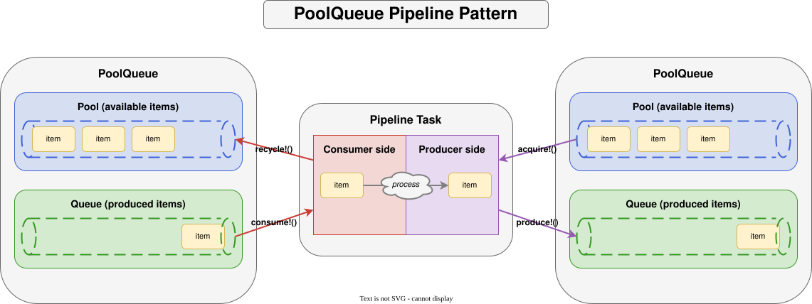
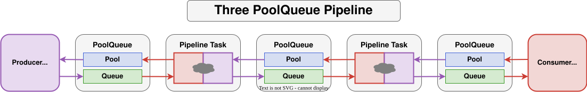

# PoolQueues.jl

PoolQueues facilitate sharing of preallocated items between producer tasks and
consumer tasks.  By pre-populating a pool with preallocated items and recycling
them back to the pool, memory allocations (and garbage collection) can be
minimized in producer/consumer pipelines.

## Overview

A `PoolQueue` is a coordination primitive built from two channels:

- a **pool** channel holding available (idle) items, and
- a **queue** channel carrying items in flight from producer to consumer.

The four main operations are:

| Operation    | Called by  | Purpose                                  |
|:-------------|:-----------|:-----------------------------------------|
| `acquire!`   | producer   | take an available item from the pool     |
| `produce!`   | producer   | put a (prepared) item onto the queue     |
| `consume!`   | consumer   | take an item from the queue              |
| `recycle!`   | consumer   | return a processed item to the pool      |

Both `produce!` and `consume!` pair also have a function form that automatically
handles `acquire!`/`recycle!`, so user code rarely needs to call those directly.

## PoolQueue usage pattern

A producer task acquires an item from the pool, fills it, and produces it; a
consumer task consumes the item, processes it, and recycles it back to the pool.
The minimal PoolQueue application consists of a single PoolQueue with a producer
task and a consumer task.



The basic usage pattern looks like this:

```julia
# Producer
while true
    item = acquire!(pq)
    # ... prepare item ...
    produce!(pq, item)
end

# Consumer
while true
    item = consume!(pq)
    # ... process item ...
    recycle!(pq, item)
end
```

The function forms make the acquire/recycle bookkeeping implicit:

```julia
# Producer
while true
    produce!(pq) do item
        # ... prepare item ...
        return item
    end
end

# Consumer
while true
    consume!(pq) do item
        # ... process item ...
        return item
    end
end
```

## The pipeline pattern

A task can be a consumer of one PoolQueue and a producer to another PoolQueue.
Such a task is known as a pipeline task.



```julia
# Pipeline task: consume from pq_in, produce to pq_out
while true
    consume!(pq_in) do item_in
        produce!(pq_out) do item_out
            # ... transform item_in into item_out ...
            return item_out # produced to pq_out's queue
        end
        return item_in  # recycled back to pq_in's pool
    end
end
```

## Multi-stage pipelines

Multiple `PoolQueue`s can be chained to form a multi-stage pipeline, with each
stage running in its own task and recycling items back to the stage that
produced them.



## Construction

A `PoolQueue` is most conveniently constructed by pre-populating the pool with
`np` items created by a function or type constructor:

```jldoctest
julia> using PoolQueues

julia> pq = PoolQueue(Vector{Float32}, 4, 4, undef, 2^20);  # 4 uninitialized Vector{Float32} of length 2^20

julia> pq1 = PoolQueue(()->zeros(Float32, 2^20), 4, 4);     # 4 Vector{Float32} of length 2^20 initialized to zeros

julia> nitems(pq)
(4, 0)

julia> maxsize(pq)
(4, 4)
```

See the [Guide](@ref) for the full set of constructor patterns and the
[API Reference](@ref) for complete signatures.

---

*This documentation was initially generated by [opencode](https://opencode.ai)
(powered by the openai/GLM-5.2 model) and subsequently reviewed and edited by
the package author.*
